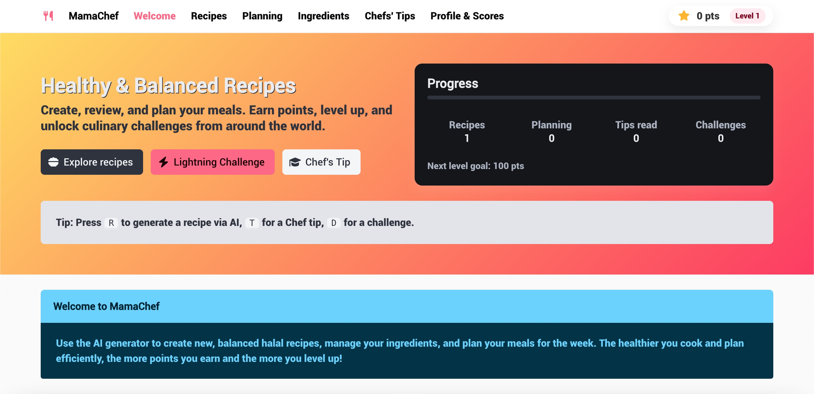
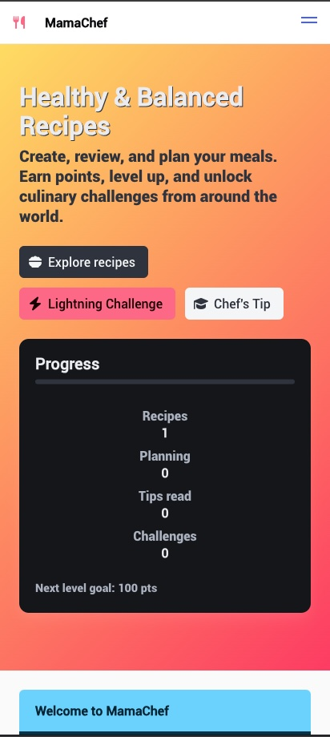

# MamaChef

MamaChef is a serious game for creating and managing recipes, planning meals, and learning good practices. It is a Progressive Web App (PWA) that can be installed on your device for offline use.

## Features

*   **AI-powered Recipe Generation:** Create new recipes using an AI prompt.
*   **Recipe Management:** View, edit, and delete your recipes.
*   **Meal Planning:** Plan your meals for the week.
*   **Ingredient Management:** Keep track of your ingredients.
*   **Shopping List:** Create a shopping list based on your planned meals.
*   **Gamification:** Earn points and level up by completing challenges and cooking healthy meals.
*   **PWA Support:** Install the app on your device for offline use.

## Technologies Used

*   **Vue.js:** A progressive JavaScript framework for building user interfaces.
*   **Bulma:** A modern CSS framework based on Flexbox.
*   **Font Awesome:** A popular icon set and toolkit.
*   **Pollinations AI:** For generating recipes and images.

## How to Use

1.  Open the `index.html` file in your web browser.
2.  Use the navigation bar to explore the different sections of the app.
3.  Use the AI prompt to generate new recipes.
4.  Add recipes to your meal plan.
5.  Manage your ingredients and shopping list.
6.  Complete challenges to earn points and level up.

## Screenshots

## PWA Support

This application is a Progressive Web App (PWA) and can be installed on your device for offline use. Look for the "Install" button in the app or your browser's address bar.

## License

This project is licensed under the MIT License - see the [LICENSE](LICENSE) file for details.